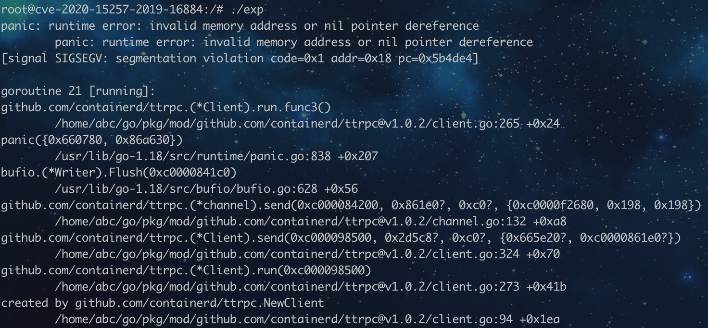

# 衍生学习：CVE-2019-16884与CVE-2020-15257的利用combo

假设一种情况，容器管理者为共享网络的容器设置了AppArmor，使容器内部的进程无法访问抽象socket，此时即便containerd-shim的socket暴露在容器中，也不会对宿主造成威胁。在这种情况下，如果存在CVE-2019-16884可以利用，就可以绕过AppArmor的限制。

复现的环境跟之前[CVE-2020-15257](README.md)的复现环境相同，不过containerd 1.3.7自带的runc已经修复了CVE-2019-16884，我又懒得装回以前的1.2.x，所以我直接从GitHub下载了一个1.0.0-rc8版本的runc替换掉了。

首先创建一个AppArmor配置，这个配置会拒绝所有对抽象socket的访问：

```
#include <tunables/global>

profile testprofile flags=(attach_disconnected,mediate_deleted) {
    #include <abstractions/base>
    file,
    network,
    deny unix addr=@**,
}
```

用这个配置创建一个共享宿主网络的容器，运行exp可以发现无法访问：



采用之前[CVE-2019-16884](../CVE-2019-16884/README.md)提到的步骤创建一个恶意镜像（需要提前把exp和shell放入root目录中再build），可以发现exp又能正常运行了，说明成功绕过了AppArmor。